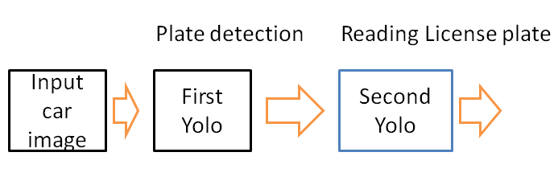
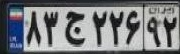
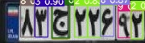

# Iranian License Plate Detection Using Yolo-v7:


The flowchart of the model is illustrated below:



Here, I applied Yolov7 in two stages

First yolo is to detect plates and crop them from the raw image.
The second yolo is to detect numbers and letters from the cropped plate.

## Stage1:

To train the yolo for plate detection, I utilized two datasets from the links below:

https://www.kaggle.com/datasets/skhalili/iraniancarnumberplate

Since the annotations are not in the right format of Yolo-v7, I used the service provided by the Roboflow website to generate corresponding annotations for Yolo-v7.

The modified dataset is available using a couple of codes below:

## usage
```python
from roboflow import Roboflow  
rf = Roboflow(api_key="ge04UulX2BqHjBuPZwfV")   
project = rf.workspace("platedetection-jgwnf").project("plate_detection-6e2ul")   
dataset = project.version(1).download("yolov7") 
```


To download the dataset, you need to first install roboflow in your environment.

After exporting the images and annotations, I finetuned the yolo-v7 using the command below:

```bash
!python train.py --batch 1 --cfg cfg/training/yolov7.yaml --epochs 30 --data you-data-path/data.yaml --weights 'yolov7.pt' --device 0 

```

Notice that yolo-v7 should be cloned from github:
https://github.com/WongKinYiu/yolov7
And also the pre-trained weights are available from the same address.

## Stage2:


In the second stage, we need to detect numbers and letters in the detected license plate.

Inspired by the work[], I applied the dataset provided in the link below for finetuning the second yolov7 to detect numbers and letters inside the plate.

https://github.com/roozbehrajabi/ALPR_Dataset/tree/main/Faster_R-CNN_dataset

Like the previous dataset, we need to change the annotation appropriate for yolov7, then regarding the previous stage, I applied the service provided by Roboflow.

After all, the modified images and annotations are available using the following codes:

```python
from roboflow import Roboflow 
rf = Roboflow(api_key="ge04UulX2BqHjBuPZwfV") 
project = rf.workspace("platedetection-jgwnf").project("numdetection")   
dataset = project.version(1).download("yolov7")  
```

After downloading the dataset, I fine-tuned the second yolov7 to detect letters inside the plates.

Notice: For the sake of time, I only utilized 500 samples of the entire dataset for the training of the second yolo. However, to increase the performance of the model, we can use the entire dataset or add other datasets if available.

Here are some examples of the input and output of the first and second yolos:

 |  |  


